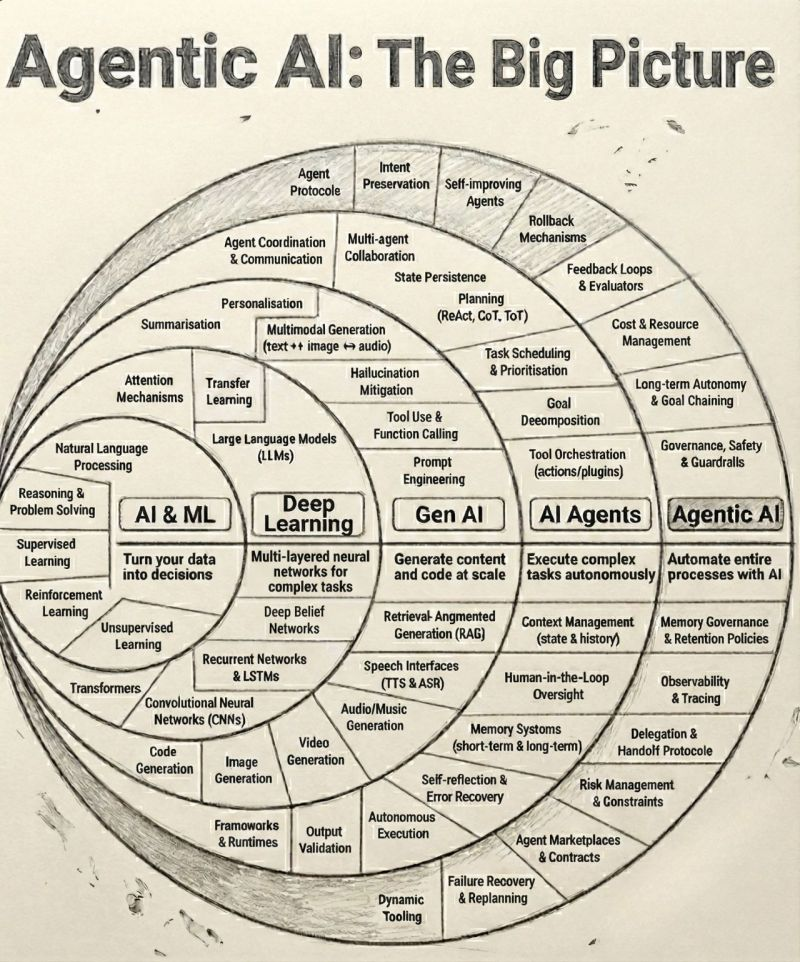

### 🌱 From AI Skills to Agentic Capability



- Everyone is talking about **AI**.
- Some are talking about **Generative AI**.
- Very few are talking about **Agentic AI**.

And that gap explains why many learners feel busy… yet unprepared. At Transflower Learning, we’ve always asked a different set of questions—long before AI entered the conversation:

- 👉 Can you **think in systems**, not just write code?
- 👉 Can you **make decisions**, not just follow instructions?
- 👉 Can you **own outcomes**, not just complete tasks?

Today, AI is evolving to answer the *same questions*.

### 🧠 The Real Evolution (Not Just a Tech Stack)

```
AI / ML       → learns patterns
GenAI         → generates content
AI Agents     → executes workflows
Agentic AI    → decides, plans, collaborates, self-corrects
```

This is not a feature upgrade. This is the **shift from tools to teammates**.


### 🔍 What Most Professionals Miss

GenAI helps you *do things faster*. Agentic AI forces you to *think better*.

Because when execution is automated:

* Instructions lose value
* Step-by-step thinking becomes obsolete
* Ownership, judgment, and architecture become the differentiators

This is why Transflower does **not train task performers**. We mentor **solution architects in the making**.

### 🏗️ The Transflower Learning Mindset

Your future relevance will not depend on:
- ❌ How many tools you know
- ❌ How many prompts you’ve memorized

It will depend on:
- ✔ How you **design workflows**
- ✔ How you **orchestrate systems**
- ✔ How you **collaborate with autonomous agents**
- ✔ How you apply **human judgment where AI cannot**

In simple terms:

> AI will execute.
> **You must decide.**


### 🌸 Personal Brand in the Agentic Era

Your profile, your work, and your learning journey should quietly signal:

- ➡️ Systems thinking
- ➡️ Strategic reasoning
- ➡️ Ability to work *with* autonomy, not fear it
- ➡️ Human insight + AI leverage

Those who position themselves as **AI-assisted thinkers** will lead. Those who position themselves as **AI-dependent executors** will compete—with machines.


### 📌 Transflower Question (Not a Rhetorical One)

- Are you just **learning skills**…
- or are you **architecting capability**?

At Transflower Learning, we believe:

> Skills get you started.
> **Capability keeps you relevant.**

And Agentic AI makes that distinction impossible to ignore.
