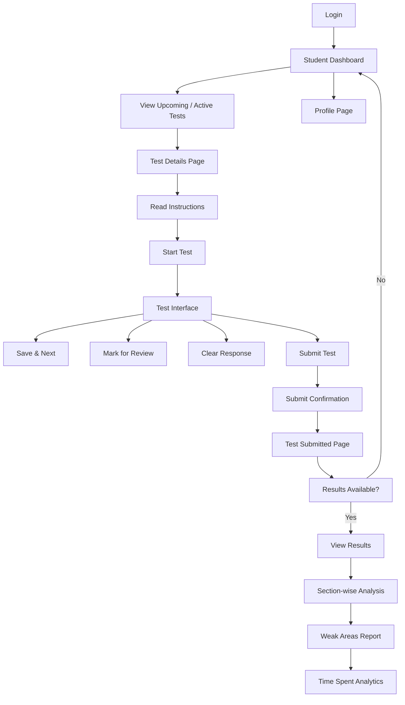
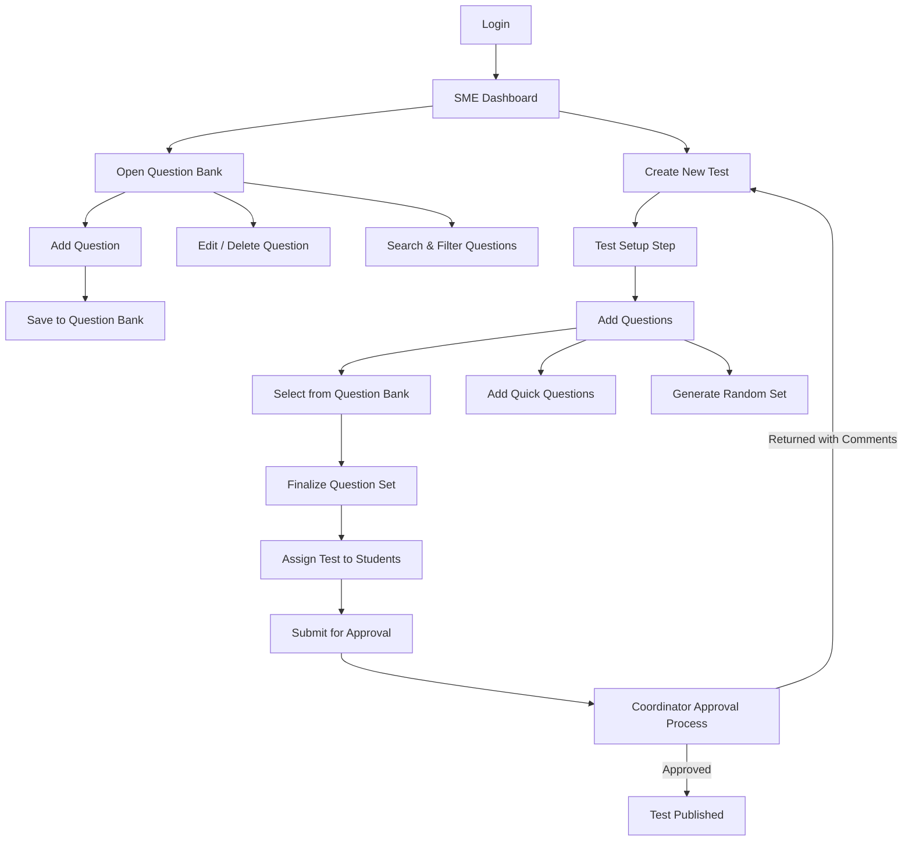
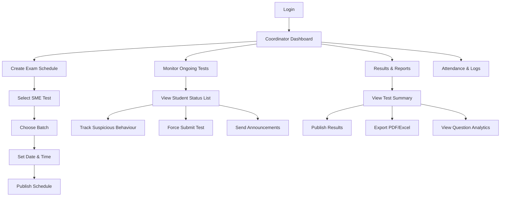
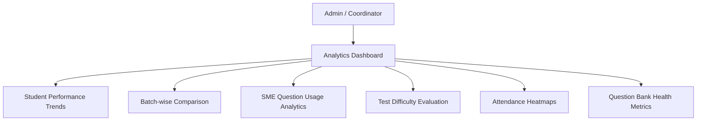

### 🌼 **1. Student Flow Diagram – Appearing for Test & Viewing Results**



### 🧑‍🏫 **2. SME Flow Diagram – Creating Questions & Building Tests**



### 🧑‍💼 **3. Exam Coordinator Flow Diagram – Scheduling, Monitoring & Publishing Results**



### 🔮 **4. System-Level Analytics Flow Diagram**




## 🌼 **1. Student User Stories**


### **US-S01: View Assigned Tests**

**As a** Student
**I want to** view all upcoming and active tests
**So that** I can prepare and start tests on time.

**Acceptance Criteria**

* **Given** I am logged in
* **When** I open the dashboard
* **Then** I should see a list of upcoming, active, and completed tests.


### **US-S02: Read Test Instructions**

**As a** Student
**I want to** read test guidelines
**So that** I understand rules before starting the exam.

**Acceptance Criteria**

* **Given** I open the test details page
* **When** I click “Start Test”
* **Then** instructions must appear with a confirmation step.


### **US-S03: Attempt Questions**

**As a** Student
**I want to** answer questions easily
**So that** I can complete my test smoothly.

**Acceptance Criteria**

* **Given** I am inside the test
* **When** I select an option
* **Then** my answer should auto-save even if I navigate between questions.


### **US-S04: Submit Test**

**As a** Student
**I want to** submit my test with confirmation
**So that** I do not submit by mistake.

**Acceptance Criteria**

* **Given** I click “Submit Test”
* **When** the system prompts confirmation
* **Then** I must confirm before final submission.


### **US-S05: View Results**

**As a** Student
**I want to** see my score and analytics
**So that** I can understand my performance.

**Acceptance Criteria**

* **Given** results are published
* **When** I open “Results”
* **Then** I should see marks, correct answers, time analytics, and weak areas.

### **US-S06: Manage Profile**

**As a** Student
**I want to** view and update my profile
**So that** my information is accurate.

# 🧑‍🏫 **2. SME User Stories**

### **US-SME01: Add Questions**

**As a** Subject Matter Expert
**I want to** create new questions
**So that** they can be used in future exams.

**Acceptance Criteria**

* **Given** I am in the question bank
* **When** I click “Add Question”
* **Then** I should be able to enter text, options, correct answer, tags, and difficulty.

### **US-SME02: Edit/Manage Question Bank**

**As a** SME
**I want to** edit and delete questions
**So that** I keep my question bank updated.


### **US-SME03: Create Test**

**As a** SME
**I want to** create tests from selected questions
**So that** the coordinator can schedule them.

**Acceptance Criteria**

* **Given** I enter test details
* **When** I add questions
* **Then** I should be able to save and submit for approval.

### **US-SME04: Tag Questions by Difficulty**

**As a** SME
**I want to** categorize questions by difficulty
**So that** balanced exams can be prepared.


### **US-SME05: Review Test Feedback**

**As a** SME
**I want to** view feedback from coordinators
**So that** I can improve test quality.


### **US-SME06: View Analytics for My Questions**

**As a** SME
**I want to** see question performance data
**So that** I know which questions are too easy or too hard.


# 🧑‍💼 **3. Exam Coordinator User Stories**


### **US-CO01: Schedule Tests**

**As a** Exam Coordinator
**I want to** schedule approved tests
**So that** students can appear on time.

**Acceptance Criteria**

* **Given** an SME-submitted test
* **When** I select batch, date, and time
* **Then** the test should become visible to students.

### **US-CO02: Monitor Live Exams**

**As a** Coordinator
**I want to** track student status in real time
**So that** I can ensure exam integrity.

**Acceptance Criteria**

* **Given** a test is ongoing
* **When** I open the monitoring page
* **Then** I should see active, inactive, and submitted students.


### **US-CO03: View Suspicious Activity**

**As a** Coordinator
**I want to** see warnings like tab-switching
**So that** I can take action.


### **US-CO04: Force Submit Exam**

**As a** Coordinator
**I want to** force-submit a student’s test
**So that** I can close their session if misconduct is detected.


### **US-CO05: Publish Results**

**As a** Coordinator
**I want to** release results after review
**So that** students can check their performance.


### **US-CO06: Export Reports**

**As a** Coordinator
**I want to** export attendance and results to Excel/PDF
**So that** records can be shared with faculty.


## 🏛️ **4. Admin User Stories**


### **US-ADM01: Manage User Roles**

**As an** Admin
**I want to** create and manage roles (Student, SME, Coordinator)
**So that** each user gets correct permissions.

### **US-ADM02: System Analytics Dashboard**

**As an** Admin
**I want to** view analytics across tests, questions, and users
**So that** I understand system efficiency.


### **US-ADM03: Manage Subjects & Batches**

**As an** Admin
**I want to** define subjects and student groups
**So that** SMEs and coordinators can assign tests properly.


## 🌼 **EPIC 1: Student Test Participation & Learning Analytics**


### **Feature 1.1 – Student Test Discovery & Access**

#### **US-S01** — View upcoming/active tests

#### **US-S02** — View test details & instructions

#### **US-S03** — See test schedule & time remaining


### **Feature 1.2 – Test Attempt Experience**

#### **US-S04** — Attempt questions with auto-save

#### **US-S05** — Navigate between questions

#### **US-S06** — Mark questions for review

#### **US-S07** — Submit test with confirmation


### **Feature 1.3 – Result Viewing & Performance Insights**

#### **US-S08** — View overall test score

#### **US-S09** — View question-wise analysis

#### **US-S10** — View time spent per question

#### **US-S11** — View weak areas summary

#### **US-S12** — Download/print test report


### **Feature 1.4 – Student Profile Management**

#### **US-S13** — View personal profile

#### **US-S14** — Update profile information

#### **US-S15** — View test history


### 🧑‍🏫 **EPIC 2: SME Question Bank & Test Creation**


#### **Feature 2.1 – Question Bank Management**

#### **US-SME01** — Add new questions

#### **US-SME02** — Edit existing questions

#### **US-SME03** — Delete a question

#### **US-SME04** — Categorize questions by topic/difficulty

#### **US-SME05** — Filter/search question bank

#### **US-SME06** — Bulk import/export questions


### **Feature 2.2 – Test Authoring**

#### **US-SME07** — Create new test

#### **US-SME08** — Add/remove questions to test

#### **US-SME09** — Define test structure (marks, duration, rules)

#### **US-SME10** — Generate random question sets

#### **US-SME11** — Save draft tests


### **Feature 2.3 – Test Submission & Feedback**

#### **US-SME12** — Submit test for approval

#### **US-SME13** — View coordinator feedback

#### **US-SME14** — Revise and resubmit test

### **Feature 2.4 – SME Analytics**

#### **US-SME15** — View usage of each question

#### **US-SME16** — See difficulty effectiveness analytics

#### **US-SME17** — See student accuracy stats on authored questions


## 🧑‍💼 **EPIC 3: Coordinator Exam Management & Monitoring**


### **Feature 3.1 – Test Scheduling**

#### **US-CO01** — View tests submitted for scheduling

#### **US-CO02** — Schedule test for batches

#### **US-CO03** — Set date, time, rules

#### **US-CO04** — Publish test schedule


### **Feature 3.2 – Exam Monitoring**

#### **US-CO05** — View ongoing exam dashboard

#### **US-CO06** — See student statuses (not started, active, submitted)

#### **US-CO07** — Track tab-switch/suspicious activity

#### **US-CO08** — Force-submit student test

#### **US-CO09** — Send announcements during exam

### **Feature 3.3 – Post-Exam Processing**

#### **US-CO10** — Review auto-evaluated scores

#### **US-CO11** — Publish results

#### **US-CO12** — Export results (Excel/PDF)

#### **US-CO13** — Export attendance logs

#### **US-CO14** — Generate test audit reports


## 🏛️ **EPIC 4: Admin Management & System Configuration**

---

### **Feature 4.1 – User & Role Management**

#### **US-ADM01** — Create user accounts

#### **US-ADM02** — Assign/manage roles (Student, SME, Coordinator)

#### **US-ADM03** — Manage access permissions


### **Feature 4.2 – Master Data Setup**

### **US-ADM04** — Create/manage subjects

### **US-ADM05** — Create batches and map students

### **US-ADM06** — Manage academic year structures


## **Feature 4.3 – Global System Settings**

### **US-ADM07** — Set test rules (default duration, negative marking)

### **US-ADM08** — Configure proctoring sensitivity

### **US-ADM09** — Backup/restore system data


## 📊 **EPIC 5: System Analytics & Insights**


### **Feature 5.1 – Student Performance Analytics**

#### **US-AN01** — View performance trends

#### **US-AN02** — Compare performance across subjects

### **US-AN03** — Identify weak/strong areas


### **Feature 5.2 – Question & Test Analytics**

#### **US-AN04** — View question effectiveness

#### **US-AN05** — View test difficulty distribution

#### **US-AN06** — Identify low-quality questions


### **Feature 5.3 – Institute-Level Insights**

#### **US-AN07** — Batch comparison analytics

#### **US-AN08** — Attendance insights

#### **US-AN09** — System usage metrics (SME, student, coordinator activity)


## 🚀 **Prioritized Product Backlog (MoSCoW Based)**

**Order: Must Have → Should Have → Could Have**


### ✅ **MUST HAVE (Critical for MVP Release)**

These items are essential for the platform to function.

#### **1. Student Test Participation (High Priority)**

1. **US-S01** – View upcoming/active tests
2. **US-S02** – View test details & instructions
3. **US-S04** – Attempt questions with auto-save
4. **US-S07** – Submit test with confirmation
5. **US-S08** – View overall test score
6. **US-S13** – View personal profile

#### **2. SME Test Creation (High Priority)**

7. **US-SME01** – Add new questions
8. **US-SME02** – Edit questions
9. **US-SME07** – Create new test
10. **US-SME08** – Add/remove questions
11. **US-SME12** – Submit test for approval

#### **3. Coordinator Scheduling & Results (High Priority)**

12. **US-CO01** – View tests submitted for scheduling
13. **US-CO02** – Schedule test for batches
14. **US-CO04** – Publish test schedule
15. **US-CO05** – View ongoing exam dashboard
16. **US-CO11** – Publish results

#### **4. Admin Essentials (High Priority)**

17. **US-ADM01** – Create user accounts
18. **US-ADM02** – Assign/manage roles
19. **US-ADM04** – Create/manage subjects
20. **US-ADM05** – Create/manage batches


🔹 **MUST HAVE Summary:**

* Core test-taking
* Question & test creation
* Scheduling
* Live exam monitoring
* Basic results
* User & subject configuration

This set creates a fully working exam system minimum viable product (MVP).


## ⭐ **SHOULD HAVE (Important but not critical for first launch)**

These enhance user experience and give more depth.


### **5. Student Enhancements**

21. **US-S05** – Navigate between questions
22. **US-S06** – Mark question for review
23. **US-S09** – View question-wise analysis
24. **US-S10** – Time spent analytics
25. **US-S15** – View test history


### **6. SME Enhancements**

26. **US-SME03** – Delete question
27. **US-SME04** – Categorize by difficulty
28. **US-SME11** – Save test as draft
29. **US-SME13** – View coordinator feedback
30. **US-SME14** – Revise test


### **7. Coordinator Enhancements**

31. **US-CO06** – Show student statuses (not started, active, submitted)
32. **US-CO07** – Suspicious behavior detection
33. **US-CO12** – Export results to Excel/PDF
34. **US-CO13** – Export attendance logs


### **8. Admin Enhancements**

35. **US-ADM06** – Manage academic year
36. **US-ADM08** – Proctoring configuration

## 💡 **COULD HAVE (Value-adding but optional)**

These features improve usability and analytics.


### **9. Student Extras**

37. **US-S11** – Generate weak areas summary
38. **US-S12** – Download printable test report
39. **US-S14** – Update profile information


### **10. SME Extras**

40. **US-SME05** – Filter/search questions
41. **US-SME06** – Bulk import/export questions
42. **US-SME10** – Random question set generation
43. **US-SME15–17** – Question difficulty usage & accuracy analytics


### **11. Coordinator Extras**

44. **US-CO08** – Force submit for misconduct
45. **US-CO09** – Send system messages/announcements
46. **US-CO14** – Test audit trails

## **12. Admin / System Analytics**

47. **US-AN01** – Student performance trends
48. **US-AN02** – Compare performance across subjects
49. **US-AN06** – Identify low-quality questions
50. **US-AN09** – System usage metrics


### 🚫 **WON’T HAVE (Not planned for immediate roadmap)**

(Not impossible—just intentionally postponed)

#### Future enhancements (possible version 2 or 3):

* AI-based proctoring (eye tracking, face detection)
* Recommendation engine for weak areas
* Gamification badges for learners
* NLP-based question generation
* Adaptive tests (difficulty adjusts automatically)

## 📦 **Backlog Ordered by Priority (Top → Bottom)**

1. Student test-taking essentials
2. SME question/test creation
3. Scheduling + Results
4. Admin setup
5. Student analytics
6. Coordinator monitoring
7. SME analytics
8. Deep insights & data reporting


## ✅ **Gherkin Acceptance Criteria for All User Stories**


## **EPIC 1: User Authentication & Authorization**


###  **Feature 1.1: User Registration**

####  **US 1.1.1 – As a student, I want to create an account so I can access the training platform.**

####  ✅ **Acceptance Criteria (Gherkin)**

```
Scenario: Successful student registration
  Given the user is on the registration page
  When the user enters valid name, email, password, and confirms the password
  And clicks the "Register" button
  Then the system should create a new account
  And send a verification email
  And display a success message

Scenario: Registration fails due to existing email
  Given the user is on the registration page
  When the user enters an email that already exists
  Then the system should show "Email already registered"

Scenario: Registration fails due to weak password
  Given the user is on the registration page
  When the user enters a weak password
  Then the system must show "Password does not meet required criteria"
```


### **Feature 1.2: User Login**

#### **US 1.2.1 – As a user, I want to log in securely using my email and password.**

```
Scenario: Successful login
  Given the user has a registered account
  When the user enters correct email and password
  Then the system should authenticate the user
  And navigate to the dashboard

Scenario: Login fails due to incorrect password
  Given the user is on the login page
  When the user enters an incorrect password
  Then the system should show "Invalid credentials"

Scenario: Account locked after multiple failures
  Given the user has failed to log in 3 times
  When the user attempts another login
  Then the system should lock the account temporarily
```


### **Feature 1.3: JWT Token Handling**

#### **US 1.3.1 – As a system, I want to issue JWT tokens so APIs can be accessed securely.**

```
Scenario: Generate JWT token after valid login
  Given the user has entered valid credentials
  When authentication is successful
  Then the system should generate a JWT token
  And return it to the client

Scenario: Reject API access without token
  Given a request is made without a token
  When the API endpoint requires authentication
  Then return HTTP 401 Unauthorized

Scenario: Reject expired token
  Given the user has an expired token
  When accessing a secure endpoint
  Then the system returns HTTP 401 with "Token expired"
```


## **EPIC 2: Training Program Management**


### **Feature 2.1: Course Catalog**

#### **US 2.1.1 – As a student, I want to view available courses.**

```
Scenario: View course catalog
  Given the user is logged in
  When the user opens the course catalog
  Then the system should display the list of courses with title and description
```

#### **US 2.1.2 – As an admin, I want to add new courses.**

```
Scenario: Add course successfully
  Given the admin is on the "Add Course" page
  When the admin enters course title, description, duration
  And clicks "Save"
  Then the course should be added to the catalog

Scenario: Failed creation due to missing title
  Given the admin is on the "Add Course" page
  When the admin leaves title blank
  Then the system should show "Title is required"
```


### **Feature 2.2: Module & Lesson Management**

#### **US 2.2.1 – As a mentor, I want to upload lessons for each module.**

```
Scenario: Upload lesson successfully
  Given the mentor is on the module page
  When the mentor uploads a valid PDF/video link
  Then the lesson should be added to the module

Scenario: Block invalid file types
  Given the mentor tries to upload an unsupported file
  Then the system displays "Unsupported file format"
```


## **EPIC 3: Student Progress & Evaluation**


### **Feature 3.1: Progress Tracking**

#### **US 3.1.1 – As a student, I want to see my course progress.**

```
Scenario: Display progress correctly
  Given the student has completed some lessons
  When the student opens the progress dashboard
  Then the system should show percentage completed for each course
```


### **Feature 3.2: Quizzes & Assessments**

#### **US 3.2.1 – As a mentor, I want to create quizzes.**

```
Scenario: Create quiz successfully
  Given the mentor is on the quiz creation page
  When they enter at least one question and answer options
  Then the quiz is saved successfully

Scenario: Prevent empty quiz
  Given the mentor submits a quiz without questions
  Then the system displays "At least one question required"
```

#### **US 3.2.2 – As a student, I want to take quizzes.**

```
Scenario: Student submits quiz
  Given the student opens an available quiz
  When the student answers all questions and submits
  Then the system calculates score
  And stores the result in progress history
```


## **EPIC 4: Communication & Notifications**


### **Feature 4.1: Mentor–Student Messaging**

#### **US 4.1.1 – As a student, I want to chat with mentors.**

```
Scenario: Send a chat message
  Given the student is on the chat screen
  When the student types a message and clicks send
  Then the mentor should receive the message in real time
```


### **Feature 4.2: Notifications**

#### **US 4.2.1 – As a user, I want to receive notifications when new lessons are added.**

```
Scenario: New lesson added notification
  Given a mentor uploads a new lesson
  When the upload is completed
  Then the system sends a push notification to all enrolled students
```


## **EPIC 5: Admin & System Management**

 

### **Feature 5.1: User Management**

#### **US 5.1.1 – As an admin, I want to activate or deactivate accounts.**

```
Scenario: Deactivate account
  Given the admin views a user profile
  When the admin clicks "Deactivate"
  Then the user should not be able to log in

Scenario: Reactivate account
  Given a user account is deactivated
  When the admin clicks "Activate"
  Then the account becomes active again
```
 

## gherkin
 

### ✅ **1. User Registration – `user_registration.feature`**

```gherkin
Feature: User Registration
  The platform must allow new students to register securely.

  Background:
    Given the user is on the registration page

  Scenario: Successful student registration
    When the user enters valid name, email, password and confirms the password
    And clicks the "Register" button
    Then the system should create a new account
    And send a verification email
    And display a success message

  Scenario: Registration fails due to existing email
    When the user enters an email that already exists
    Then the system should show "Email already registered"

  Scenario: Registration fails due to weak password
    When the user enters a weak password
    Then the system must show "Password does not meet required criteria"
```


### ✅ **2. User Login – `user_login.feature`**

```gherkin
Feature: User Login
  Users must be able to securely log in with valid credentials.

  Background:
    Given the user is on the login page

  Scenario: Successful login
    When the user enters correct email and password
    Then the system should authenticate the user
    And navigate to the dashboard

  Scenario: Login fails due to incorrect password
    When the user enters an incorrect password
    Then the system should show "Invalid credentials"

  Scenario: Account locked after multiple failures
    Given the user has failed to log in 3 times
    When the user attempts another login
    Then the system should lock the account temporarily
```

### ✅ **3. JWT Token Handling – `jwt_token.feature`**

```gherkin
Feature: JWT Token Management
  The system must use JWT tokens for secure API access.

  Scenario: Generate JWT token after valid login
    Given the user has entered valid credentials
    When authentication is successful
    Then the system should generate a JWT token
    And return it to the client

  Scenario: Reject API access without token
    Given a request is made without a token
    When the API endpoint requires authentication
    Then return HTTP 401 Unauthorized

  Scenario: Reject expired token
    Given the user has an expired token
    When accessing a secure endpoint
    Then the system returns HTTP 401 with "Token expired"
```


### ✅ **4. Course Catalog – `course_catalog.feature`**

```gherkin
Feature: Course Catalog
  Students must be able to explore available courses.

  Scenario: View course catalog
    Given the user is logged in
    When the user opens the course catalog
    Then the system should display a list of courses with title and description
```


### ✅ **5. Course Creation (Admin) – `course_creation.feature`**

```gherkin
Feature: Course Creation (Admin)
  Admins must be able to create and publish new courses.

  Background:
    Given the admin is logged in

  Scenario: Add course successfully
    When the admin enters course title, description, and duration
    And clicks "Save"
    Then the course should be added to the catalog

  Scenario: Failed creation due to missing title
    When the admin leaves the course title blank
    Then the system should show "Title is required"
```


### ✅ **6. Module & Lesson Upload – `module_lessons.feature`**

```gherkin
Feature: Module and Lesson Management
  Mentors must be able to upload lessons for each course module.

  Background:
    Given the mentor is logged in

  Scenario: Upload lesson successfully
    When the mentor uploads a valid PDF or video link
    Then the lesson should be added to the module

  Scenario: Block invalid file types
    When the mentor tries to upload an unsupported file
    Then the system displays "Unsupported file format"
```


### ✅ **7. Student Progress Tracking – `student_progress.feature`**

```gherkin
Feature: Student Progress Tracking
  Students must be able to see their progress clearly.

  Scenario: Display progress correctly
    Given the student has completed some lessons
    When the student opens the progress dashboard
    Then the system should show percentage completed for each enrolled course
```


### ✅ **8. Quiz Creation (Mentor) – `quiz_creation.feature`**

```gherkin
Feature: Quiz Creation
  Mentors must be able to create quizzes for students.

  Background:
    Given the mentor is on the quiz creation page

  Scenario: Create quiz successfully
    When the mentor enters at least one question and answer options
    Then the quiz is saved successfully

  Scenario: Prevent empty quiz creation
    When the mentor submits a quiz without questions
    Then the system displays "At least one question required"
```


### ✅ **9. Quiz Taking (Student) – `quiz_attempt.feature`**

```gherkin
Feature: Quiz Attempt
  Students must be able to take quizzes.

  Scenario: Student submits quiz
    Given the student opens an available quiz
    When the student answers all questions and submits the quiz
    Then the system calculates the score
    And stores the result in progress history
```


### ✅ **10. Messaging System – `messaging.feature`**

```gherkin
Feature: Mentor-Student Messaging
  Students and mentors should be able to communicate in real time.

  Scenario: Send a chat message
    Given the student is on the chat screen
    When the student types a message and clicks send
    Then the mentor should receive the message in real time
```


### ✅ **11. Notifications – `notifications.feature`**

```gherkin
Feature: Notifications
  Users must receive important system notifications.

  Scenario: New lesson added notification
    Given a mentor uploads a new lesson
    When the upload is completed
    Then the system sends a notification to all enrolled students
```

### ✅ **12. User Management (Admin) – `user_management.feature`**

```gherkin
Feature: User Management
  Admins must be able to manage user accounts.

  Background:
    Given the admin is logged in

  Scenario: Deactivate account
    When the admin clicks "Deactivate"
    Then the user should not be able to log in

  Scenario: Reactivate account
    When the admin clicks "Activate"
    Then the user account should become active again
```


### Step Definition Templates

#### 📁 **1. Step Definitions – `UserRegistrationSteps.java`**

```java
package steps;

import io.cucumber.java.en.*;

public class UserRegistrationSteps {

    @Given("the user is on the registration page")
    public void theUserIsOnRegistrationPage() {
        // TODO: Navigate to registration page
    }

    @When("the user enters valid name, email, password and confirms the password")
    public void entersValidRegistrationDetails() {
        // TODO: Fill form with valid data
    }

    @When("clicks the {string} button")
    public void clicksButton(String button) {
        // TODO: Click a button by label
    }

    @Then("the system should create a new account")
    public void systemCreatesAccount() {
        // TODO: Validate DB / API response / UI message
    }

    @Then("send a verification email")
    public void sendVerificationEmail() {
        // TODO: Mock email service OR check email logs
    }

    @Then("display a success message")
    public void displaySuccessMessage() {
        // TODO: Assert success notification
    }

    @When("the user enters an email that already exists")
    public void entersExistingEmail() {
        // TODO: Enter already registered email
    }

    @Then("the system should show {string}")
    public void systemShouldShowMessage(String message) {
        // TODO: Assert message shown on UI
    }

    @When("the user enters a weak password")
    public void entersWeakPassword() {
        // TODO: Enter invalid password pattern
    }
}
```


#### 📁 **2. Step Definitions – `UserLoginSteps.java`**

```java
package steps;

import io.cucumber.java.en.*;

public class UserLoginSteps {

    @Given("the user is on the login page")
    public void userOnLoginPage() {
        // TODO: Open login page
    }

    @When("the user enters correct email and password")
    public void enterCorrectCredentials() {
        // TODO: Enter valid login credentials
    }

    @Then("the system should authenticate the user")
    public void authenticateUser() {
        // TODO: Validate login success
    }

    @Then("navigate to the dashboard")
    public void navigateToDashboard() {
        // TODO: Ensure dashboard is opened
    }

    @When("the user enters an incorrect password")
    public void entersIncorrectPassword() {
        // TODO: Enter wrong password
    }

    @Given("the user has failed to log in 3 times")
    public void failedThreeTimes() {
        // TODO: Simulate 3 failed login attempts
    }

    @Then("the system should lock the account temporarily")
    public void lockAccount() {
        // TODO: Validate "Account locked"
    }
}
```

#### 📁 **3. Step Definitions – `JwtSteps.java`**

```java
package steps;

import io.cucumber.java.en.*;
import static org.junit.Assert.*;

public class JwtSteps {

    private String token;
    private int responseCode;

    @Given("the user has entered valid credentials")
    public void validCredentials() {
        // TODO: Prepare valid login payload
    }

    @When("authentication is successful")
    public void authenticationSuccessful() {
        // TODO: Call login API and store token
    }

    @Then("the system should generate a JWT token")
    public void generateToken() {
        // TODO: Assert token != null
    }

    @Then("return it to the client")
    public void returnToken() {
        // TODO: Add API response validation
    }

    @Given("a request is made without a token")
    public void requestWithoutToken() {
        // TODO: Call API without Authorization header
    }

    @Then("return HTTP 401 Unauthorized")
    public void returns401() {
        // TODO: Assert responseCode == 401
    }

    @Given("the user has an expired token")
    public void expiredToken() {
        // TODO: Create or mock expired JWT
    }

    @Then("the system returns HTTP 401 with {string}")
    public void tokenExpiredError(String message) {
        // TODO: Validate error message
    }
}
```

#### 📁 **4. Step Definitions – `CourseCatalogSteps.java`**

```java
package steps;

import io.cucumber.java.en.*;

public class CourseCatalogSteps {

    @Given("the user is logged in")
    public void userLoggedIn() {
        // TODO: Login via UI or API
    }

    @When("the user opens the course catalog")
    public void openCourseCatalog() {
        // TODO: Navigate to catalog
    }

    @Then("the system should display a list of courses with title and description")
    public void displayCourseList() {
        // TODO: Assert course list UI elements exist
    }
}
```


#### 📁 **5. Step Definitions – `CourseCreationSteps.java`**

```java
package steps;

import io.cucumber.java.en.*;

public class CourseCreationSteps {

    @Given("the admin is logged in")
    public void adminLoggedIn() {
        // TODO: Login as admin
    }

    @When("the admin enters course title, description, and duration")
    public void adminEntersCourseInfo() {
        // TODO: Fill input fields
    }

    @Then("the course should be added to the catalog")
    public void courseAddedToCatalog() {
        // TODO: Validate creation success
    }

    @When("the admin leaves the course title blank")
    public void missingCourseTitle() {
        // TODO: Submit form without title
    }

    @Then("the system should show {string}")
    public void systemShowsError(String errorMessage) {
        // TODO: Assert validation message
    }
}
```


#### 📁 **6. Step Definitions – `QuizCreationSteps.java`**

```java
package steps;

import io.cucumber.java.en.*;

public class QuizCreationSteps {

    @Given("the mentor is on the quiz creation page")
    public void mentorOnQuizPage() {
        // TODO: Navigate to quiz builder
    }

    @When("the mentor enters at least one question and answer options")
    public void enterQuizQuestions() {
        // TODO: Add question & options
    }

    @Then("the quiz is saved successfully")
    public void quizSaved() {
        // TODO: Validate quiz created
    }

    @When("the mentor submits a quiz without questions")
    public void submitEmptyQuiz() {
        // TODO: Click save without input
    }

    @Then("the system displays {string}")
    public void displayErrorMessage(String message) {
        // TODO: Validate UI message
    }
}
```


#### 📁 **7. Step Definitions – `QuizAttemptSteps.java`**

```java
package steps;

import io.cucumber.java.en.*;

public class QuizAttemptSteps {

    @Given("the student opens an available quiz")
    public void openQuiz() {
        // TODO: Navigate to quiz attempt
    }

    @When("the student answers all questions and submits the quiz")
    public void submitQuiz() {
        // TODO: Answer and submit
    }

    @Then("the system calculates the score")
    public void calculateScore() {
        // TODO: Assert score computed
    }

    @Then("stores the result in progress history")
    public void storeResult() {
        // TODO: Validate DB/API entry
    }
}
```

#### 📁 **8. Step Definitions – `MessagingSteps.java`**

```java
package steps;

import io.cucumber.java.en.*;

public class MessagingSteps {

    @Given("the student is on the chat screen")
    public void studentOnChatScreen() {
        // TODO: Open chat UI
    }

    @When("the student types a message and clicks send")
    public void studentSendsMessage() {
        // TODO: Enter text & click send
    }

    @Then("the mentor should receive the message in real time")
    public void mentorReceivesMessage() {
        // TODO: Validate via websocket or polling
    }
}
```


#### 📁 **9. Step Definitions – `NotificationSteps.java`**

```java
package steps;

import io.cucumber.java.en.*;

public class NotificationSteps {

    @Given("a mentor uploads a new lesson")
    public void mentorUploadsLesson() {
        // TODO: Simulate lesson upload
    }

    @When("the upload is completed")
    public void uploadCompleted() {
        // TODO: Trigger notification event
    }

    @Then("the system sends a notification to all enrolled students")
    public void notificationSent() {
        // TODO: Validate notification delivery
    }
}
```


## 📁 **10. Step Definitions – `UserManagementSteps.java`**

```java
package steps;

import io.cucumber.java.en.*;

public class UserManagementSteps {

    @When("the admin clicks {string}")
    public void adminClicks(String action) {
        // TODO: Click Activate/Deactivate
    }

    @Then("the user should not be able to log in")
    public void userCannotLogin() {
        // TODO: Assert login blocked
    }

    @Then("the user account should become active again")
    public void userAccountActive() {
        // TODO: Assert login success
    }
}
```


## 🎁 **Bonus: Reusable Hooks File – `Hooks.java`**

```java
package hooks;

import io.cucumber.java.Before;
import io.cucumber.java.After;

public class Hooks {

    @Before
    public void setup() {
        // TODO: Initialize driver / API client
    }

    @After
    public void teardown() {
        // TODO: Quit driver / clean mocks
    }
}
```


Tap your potential
